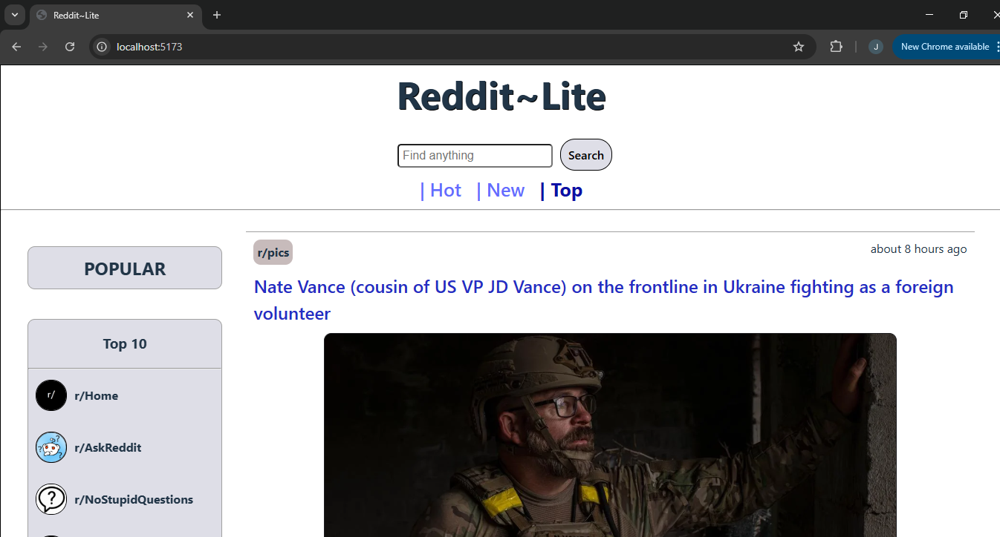
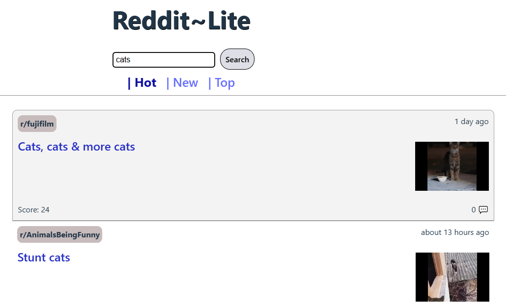
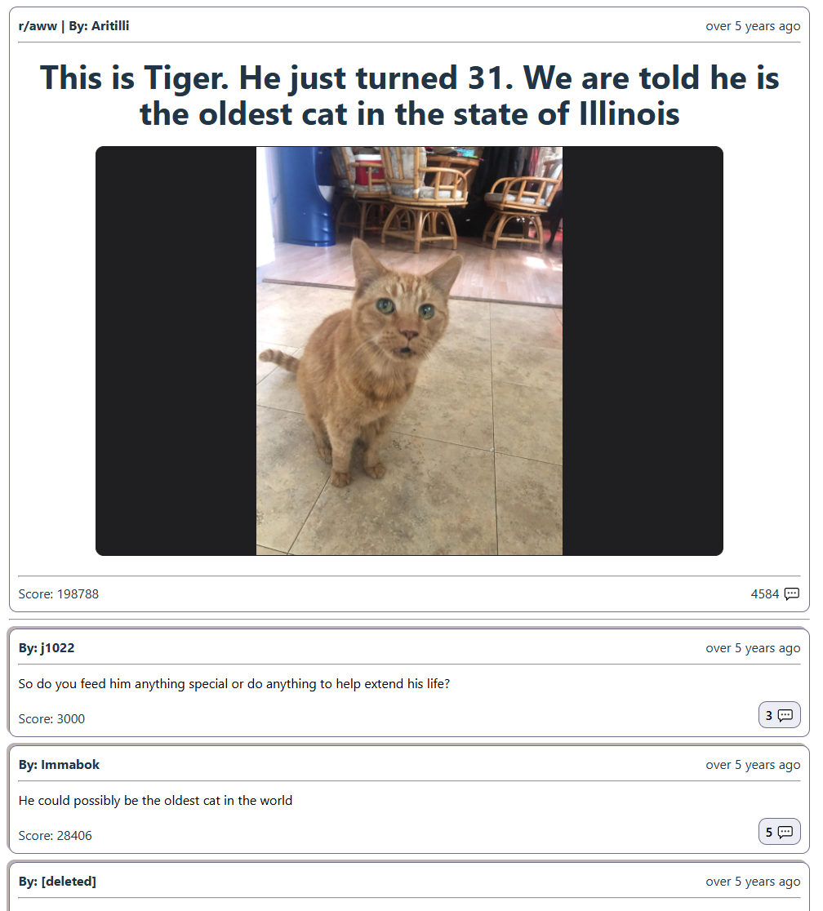
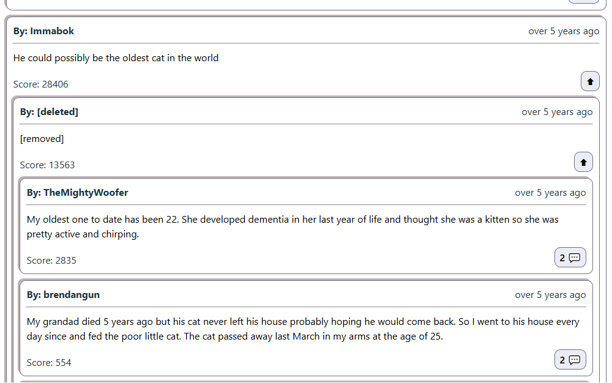

# Reddit~Lite

## Overview

This is a frontend web application built with **React** and **Redux**. The application allows users to view popular posts and subreddits, search for posts, and sort them by different criteria. Each post is clickable and displays the full content along with comments, with the ability to expand and show comment replies.

### Key Features:
- **View Popular Posts**: Display a feed of popular posts from Reddit.
- **Search**: A search bar to find posts by title or keyword.
- **Sorting Options**: Sort posts by `hot`, `new`, or `top` criteria.
- **Post Details**: Clicking on a post will open a detailed view with the full text, media, and comments.
- **View Comments**: Display comments for each post. If a comment has replies, they can be expanded by clicking a button.
- **Read-Only App**: No authentication is required, and all data is fetched via public API calls to Reddit.

## Technologies Used

- **React**
- **React Router**
- **Redux**
- **Reddit's JSON API**: Used for fetching public data

## Installation & Setup

### Steps:
1. **Clone the repository**:
    ```bash
    git clone https://github.com/jfg0034/Reddit-Lite
    cd reddit_lite
    ```

2. **Install dependencies**:
    ```bash
    npm install
    ```

3. **Start the application**:
    ```bash
    npm run dev
    ```

4. Open browser and visit [http://localhost:5173](http://localhost:5173)

## Application Structure

reddit_lite/<br>
│── public/ 
│── src/                
│   ├── api/             # API calls to Reddit's JSON API<br> 
│   ├── app/             # Main App component, router and store configuration<br> 
│   ├── components/      # Reusable components<br>
│   ├── features/        # Feature components and their slices<br>
│   ├── layout/          # Main layout<br>
│   ├── utils/           # Helper functions<br>
│   ├── main.jsx         # Entry point<br>
│── ... <br>

## Features Breakdown

### 1. Home Page
The homepage displays a feed of popular posts from Reddit. Posts are fetched from the Reddit API and displayed in a list. A search bar and sorting buttons are displayed on the top, and a list of popular subreddits are presented on a banner on the left.


### 2. Results
The search bar allows users to search for posts by title or keyword. The results are displayed based on the search query, and the user can apply filters such as sorting by `'new'`, `'top'`, and default as `'hot'`.


### 3. Post Details
When a user clicks on a post, they are taken to a detailed view page with post content such as media, text, and comments.


### 4. Comment Thread Expansion
Comments can sometimes have replies, when available replies can be expanded within each comment.



## 📌 Notes
This is a read-only app focused on lightweight data. Currently, posts and search results do not support pagination and are limited to 25 items per subreddit or search query. Comments are displayed with some nested replies visible; however, retrieving large comment threads requires additional API calls, which are not supported in this project.

## License

MIT License
